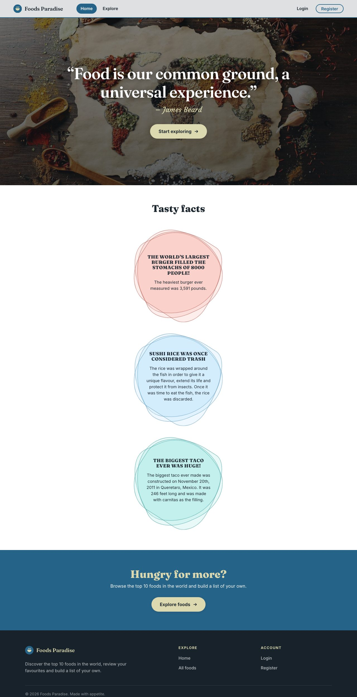
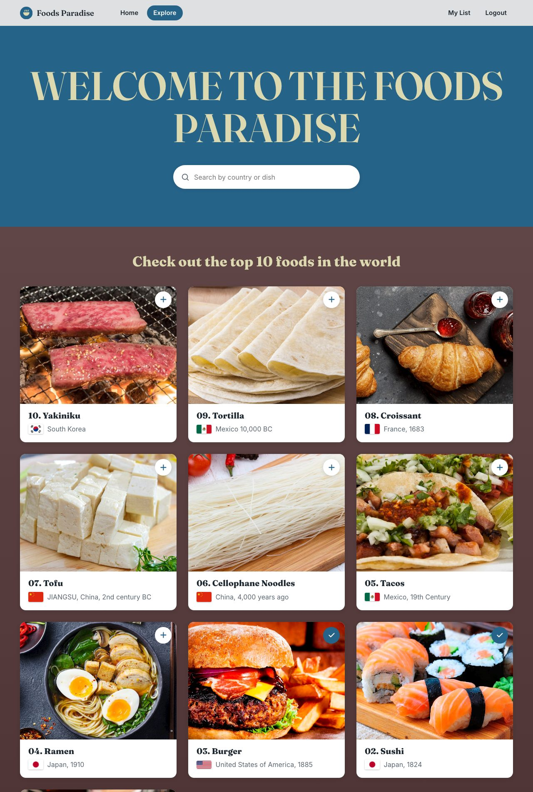
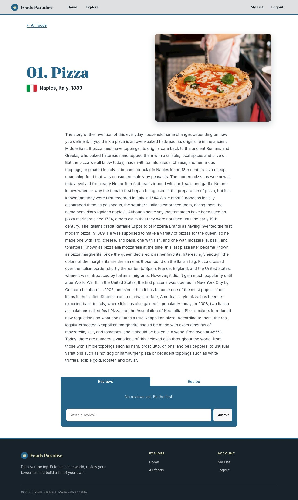
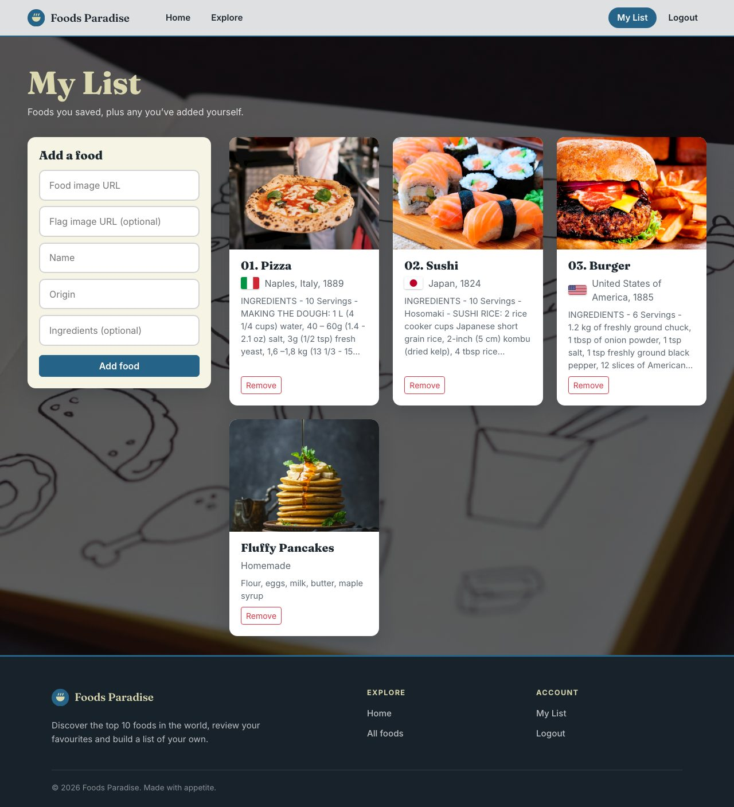
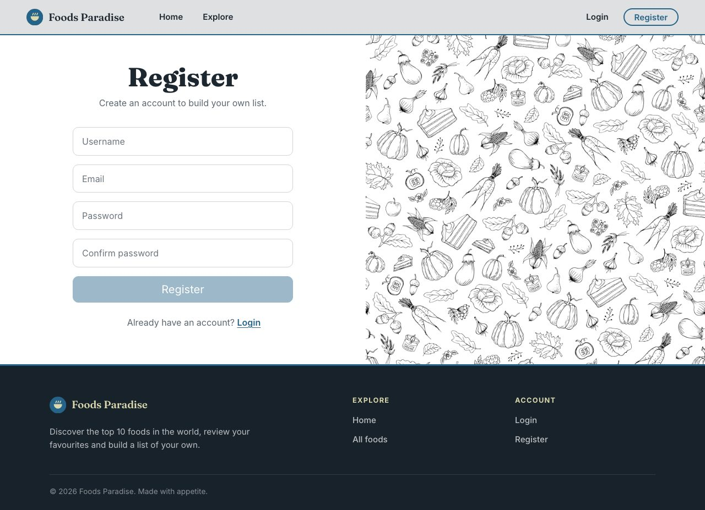
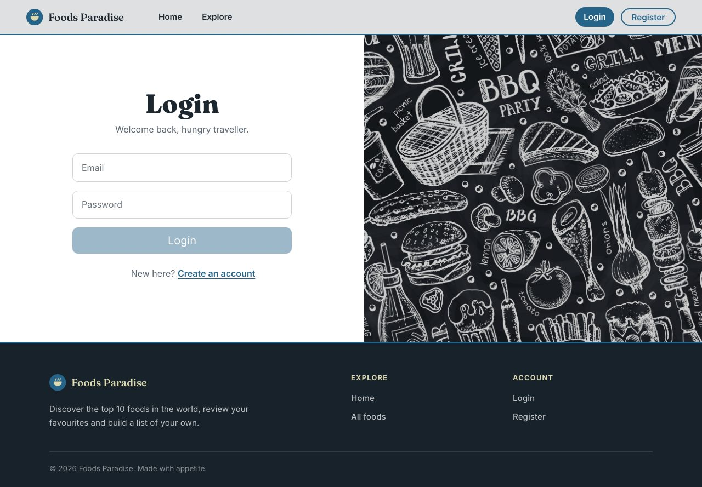

# Project 3 - Foods Paradise

`Check out the top 10 foods in the world. Log in to add a review, make a list of your favorites foods and their ingredients or create and add your own food to the list!`

## Table of Contents:

1.  Project Overview
2.  Installation
3.  Features
4.  Project Brief
5.  Technologies Used
6.  Timeline
7.  Wins and Challenges
8.  Future Content and Improvements
9.  Key Learnings
10. Credits
11. Recent Updates

## Project Overview

Project 3 was a very fun experience where I had the opportunity to work collaboratively with two talented team members to develop my first full-stack application using the MERN stack. After a brief discussion, we decided to create a website that would allow users to browse the top 10 foods in the world, add them to their own list, create custom foods, or leave reviews for existing ones. Collaborating with others was a rewarding and enjoyable experience, and this project turned out to be one of my favorites from my time at GA.

You can find the deployed project [here](https://foods-paradise.netlify.app/)

As most actions are locked before authentication registration would be required, so create an account on the Register page. When you run the project locally, `npm run seed-db` also creates two demo accounts (`admin@gmail.com` and `user@gmail.com`) whose passwords you choose yourself in the backend `.env` file (see Installation).

## Installation

To run this project you have to type in your terminal git clone and the name of the ssh key inside an empty folder. Run **code .** to open the directory in your Visual Studio Code. There you can right click the backend folder and **open in integrated terminal**. To run the backend you need to have Node.js installed. To install Node.js visit its website [here](https://nodejs.org/), download the appropriate version of Node.js for your operating system. Run the downloaded installation file and follow the prompts to install Node.js on your computer. In the Visual Studio Code terminal type **node -v** and press Enter to verify that Node.js is installed and to check its version. Now for the project installation steps:

1. You need a running MongoDB instance (local or Atlas).
2. When you are in the backend terminal you need to install some dependencies so run **npm install**.
3. Copy **.env.example** to **.env** and fill it in (see the table below). `JWT_SECRET` should be a long random value, e.g. `node -e "console.log(require('crypto').randomBytes(48).toString('hex'))"`.
4. Optional: run **npm run seed-db** to load the foods and two demo accounts. This **wipes the database**, so it refuses to run against a non-local database unless `ALLOW_REMOTE_SEED=true`.
5. Run the server by typing **npm start** (it listens on port 2002).
6. Now right click on the frontend folder and again **open in integrated terminal**.
7. Install the necessary dependencies by running **npm install**.
8. Type **npm run dev** in the frontEnd terminal to run the server and then open that url in your browser. Add that url to `CORS_ORIGIN` in the backend `.env` (Vite uses `http://localhost:5173` by default, or the next free port).

### Environment variables

Backend (`BackEnd/.env`, git-ignored; template in `.env.example`):

| Variable | Purpose |
|---|---|
| `DB_CONNECTION_STRING` | MongoDB URL. Required in production. |
| `JWT_SECRET` | Secret used to sign login tokens. Required in production. |
| `PORT` | Port to listen on (default 2002). |
| `CORS_ORIGIN` | Comma-separated front-end origins allowed to call the API. Empty allows any origin. |
| `SEED_ADMIN_PASSWORD`, `SEED_USER_PASSWORD` | Passwords for the demo accounts created by `seed-db`. |
| `ALLOW_REMOTE_SEED` | Set to `true` to let `seed-db` wipe a non-local database. |

Frontend (optional, `FrontEnd/.env`): `VITE_API_URL` overrides the API address (defaults to `http://localhost:2002` in development and the deployed API in production). It is public in the built bundle, so never put secrets in it.

## Features

- Home page displaying random facts about some of the foods included in the list
- Browse page displaying the top 10 foods in the world with images and their country of origin and a search bar to search a food by its country or dish
- Detail page for each food with more information and the ability to leave and edit a review
- List page where users can add and remove foods from their personal list as well as create their own custom foods
- User authentication system using JWT (7-day tokens, hashed passwords, rate-limited login and register)
- Responsive, accessible interface that works on phones, tablets and desktops
- Backend API built with Node.js and Express.js
- Database using MongoDB atlas to deploy

## The Brief

- Build a full-stack application by making your own backend and your own frontend
- Use an Express API to serve your data from a Mongo database
- Consume your API with a separate frontend built with React
- Be a complete product which most likely means multiple relationships and CRUD functionality for at least a couple of models
- Be deployed online so it's publicly accessible

## Technologies Used

### Backend:

- Node.js: a JavaScript runtime built on Chrome's V8 JavaScript engine
- Express: a popular Node.js framework for building web applications
- Mongoose: an Object Data Modeling (ODM) library for MongoDB and Node.js
- bcrypt: a library for hashing passwords
- CORS: a middleware that enables Cross-Origin Resource Sharing (CORS) for Express
- Dotenv: a module that loads environment variables from a .env file
- express-validator: a middleware for validating request data in Express
- jsonwebtoken: a library for generating and verifying JSON Web Tokens (JWT)
- helmet: sets secure HTTP response headers
- express-rate-limit: limits repeated requests, especially on login and register

### Frontend:

- React: a JavaScript library for building user interfaces
- Bootstrap: a popular CSS framework for building responsive web pages
- Axios: a promise-based HTTP client for making API requests from the browser
- react-bootstrap: a library that provides Bootstrap components as React components
- react-router-dom: a library for routing and navigation in React applications
- Sass: a popular CSS preprocessor

### Development and Deployment

- Npm
- Git/GitHub
- Excalidraw
- Postman
- Mongo Atlas
- Render
- Netlify

## Timeline

> The code screenshots in this section show the project as it was originally submitted. Some of the code has since changed, see [Recent Updates](#recent-updates).

### Day 1

On our first day, we began by brainstorming ideas for our main project and setting stretch goals. We documented our plan in Excalidraw, a collaborative whiteboarding tool. We decided to work together using Visual Studio Code's live share option, which allowed us to correct each other, share thoughts, and solve problems as a team. Although this approach may have taken us more time in the short term, it proved invaluable in helping us better understand the code we were writing by explaining it to each other.

### Day 2,3

On our second day, we started working on the backEnd. We began with the basics like creating the server.js and consts.js file and tested the backEnd with Postman. We stored the DB_CONNECTION_STRING and JWT_SECRET in the .env file which was included in the .gitignore file.

*Original version*

*Original version*

The **DB_CONNECTION_STRING** and **JWT_SECRET** come from the **.env** file that we later added in the backEnd folder and was included in the .env that our **.gitignore** file contained. Then we continued to create our food and user models.

foodSchema:

*Original version*

On the following days we added a utils folder which would include the seed data and the connectToDb function used in the server.js file.

connectToDb function:

*Original version*

To better organize our data, we kept the food and user data in separate files within the utils folder:

*Original version*

### Day 4,5

On the fourth day, we shifted our focus to writing the middleware for the project. We began by creating a middleware folder that would contain several middleware functions such as a validator middleware, a logger, a fallback function, an error handler, and an authentication middleware.

Middleware folder:

*Original version*

Auth middleware:

*Original version*

Then we started working on the more time consuming and challenging part of the backend, that being the controllers and the router.js file. We first started with the easiest ones like the food controller and router.

We created some of the routers using the auth and validate middleware in some of them :

*Original version*

We then wrote the code for the controllers used in the routers like the foodController:

*Original version*

All the functions of each controller are exported in an object form so that they are easily accessed in the router file:

*Original version*

As it turned out, we had the most trouble with the reviews part. First we had to figure out how to set up the review schema and then how to implement the reviews array inside the foodSchema:

*Original version*

Then for the controller we had to push the review with the text that was created in the req.body into the reviews array and save the food.

*Original version*

### Day 6,7,8,9 and 10

On day six we finished the final controllers for the backend and got started on the frontend side. The register and login page were completed first as we had done something similar before in class.
We also added errors and some additional validation.

*Original version*

We then shifted our attention to the navbar and homepage. For the navbar we wanted to have some conditional rendering if the user was signed in or not. So if the user was logged in, the Register and Login links in **Home Explore Register Login** would be replaced
by **my List** and **logout**.

*Original version*

*Original version*

Our footer was quite similar with a slightly different style, while the homepage did not have any additional functionality as it mainly focused on improving the visual design.

The explore page was next and was propably the trickiest one. We first worked on the search bar logic, making it so that you could search for a food by country using a dropdown menu and then rendered each food on the page.

Search bar logic:

*Original version*

After that we added the food page, which would contain a more detailed description of each food, with a form to leave a review as well.

### Day 11,12

While working on the project, we mainly collaborated using Visual Studio Code's live share feature. However, as the deadline approached, we found that, while helpful, this approach was quite time-consuming. As a result, we decided to split the workload among team members to improve efficiency. We worked on separate branches and later merged them with the main branch in GitHub. I was responsible for creating the “My List” page, while my team members worked on styling and the “Add a Review” feature. On the My List page, I aimed to provide users with the ability to create a custom food item by submitting a form. Additionally, users could add foods from the Explore page to their list and remove items using a delete button. This allowed users to curate a personalized list of their favorite foods.

Remove from list logic using **filter** function:

*Original version*

foodId was used as a parameter in the remove function and item.\_id was passed as an argument in the onClick function of the button:

*Original version*

The form was created in a similar way with the register and login page:

*Original version*

by using spread operator to push the e.target.value to each input by selecting its name with [e.target.name]:

*Original version*

After finishing my work on the List page, I assisted one of my teammates with implementing the "add review" feature. We encountered a minor challenge where we were unable to display the newly added review on the page without a refresh. Eventually, we discovered that we simply needed to send an axios.get request for that specific food item again.

*Original version*

After creating the 'My List' page and 'Add Review' feature, we wanted to add a button to allow users to add foods to their list directly from the explore page. This was done with some guidance from our instructor as we ran into some problems. To indicate whether a food had already been added to the list, we implemented a checkmark icon that appears on the button after the food is added. For this to work we created a separate food card component where we checked if the food already existed in the user's list with a find function:

*Original version*

and used ternary operator to render the buttons:

*Original version*

Then the Food card was used in the explore page:

*Original version*

### Day 13

On the last day, we spent time fixing minor bugs, enhancing the styling, and deploying the project. To deploy the frontend, we used **Netlify** and for the backend, we utilized **MongoDB Atlas**.

## Final project:

#### Homepage:

#### Explore page:

#### Food page:

#### My list page:

#### Register page:

#### Log in page:

## Wins and Challenges

### Wins

We faced an issue where our authentication token would be lost when we refreshed the page while logged in which took a to figure out. Another significant achievement was successfully implementing the 'add to list' button and its ability to change to a checkmark if the food was added.

### Challenges

Most of our challenges were encountered in the frontend development. We found implementing the search bar and adding review functionality a bit challenging, but we were ultimately able to find solutions for both.

## Future Content and Improvements

Some of my future content plans:

- Make the styling responsive to different screen sizes (completed)
- Improve the styling of the ingredients (e.g. show them as a list)
- Adding the ability for a user to edit a review he has submitted (completed)
- Making the code more consise and readable (in progress)
- Add automated tests for the API and the main user flows
- Let users delete their own reviews

## Key Learnings

This project was the most challenging so far in the course as we had to create both the backend and frontend ourselves, but also because it was the first group project we had done. However, it taught me valuable lessons on how to effectively communicate ideas and code with my team members, organize meetings, do some pair programming, and push each other to write better code. In addition, the project provided me with valuable experience in managing my time when working on a larger-scale project and gave me insight into how roles are assigned to different team members. I also gained a lot of experience using GitHub as well, working on different branches, committing and pushing code. Overall this was a great and very useful experience in my coding career, one that I would want to replicate again in the future.

## Recent Updates

After the course, the project received a design and security pass. The overall structure and colour palette stayed the same.

### Design

- Rebuilt the styles on shared design tokens (colours, radius, shadows, fonts) in `FrontEnd/src/styling/base.scss`, replacing the fixed-pixel and absolute-position layouts. Bootstrap is now loaded before the app styles, which removed the double underlines on links.
- New navigation bar with a logo mark and pill-style links (the current page is a filled pill) and a new four-part footer with a short description and link columns.
- Home: darker hero overlay for readable text, a call-to-action button, readable fact bubbles in a responsive grid and a closing call-to-action section.
- Explore: responsive card grid, search by country or dish with flags, loading placeholders, an overlay "add to my list" button and the foods ranked 10 to 1.
- Food page: two-column header, a readable description block, tabs opening on Reviews and empty states for reviews and recipes.
- Login and Register: split layout kept, with labels, autofill hints, a link to switch between the two and matching password validation.
- My List: sticky "Add a food" panel next to a card grid, plus an empty state.
- Shared login state moved into a `useAuth` hook, and a new favicon.

### Bug fixes

- New reviews were saved empty because the input was bound to a different state than the submit used. Add and edit now share one field, with a Cancel button.
- Passwords were being logged to the browser console and the server log. Both removed.
- Crashes on a missing food id, an empty review and failed network requests were fixed.

### Backend and security

- Registration only accepts email, username and password, so nobody can register themselves as an admin.
- Only admins can update foods (the check used to happen after the update).
- Password hashes are no longer returned by any endpoint, `/users` is admin only and the register response no longer leaks the hash.
- Login tokens expire after 7 days, and the server refuses to start in production without `JWT_SECRET` and `DB_CONNECTION_STRING`.
- Added `helmet`, rate limiting, CORS restricted by `CORS_ORIGIN`, case-insensitive email matching and a unique email index.
- Secrets live in a git-ignored `.env`. `seed-db` takes its passwords from `.env` and refuses to wipe a non-local database.
- Removed the unused `cloudinary` and `uuidv4` packages.

